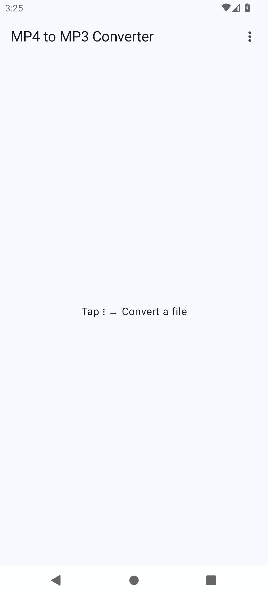
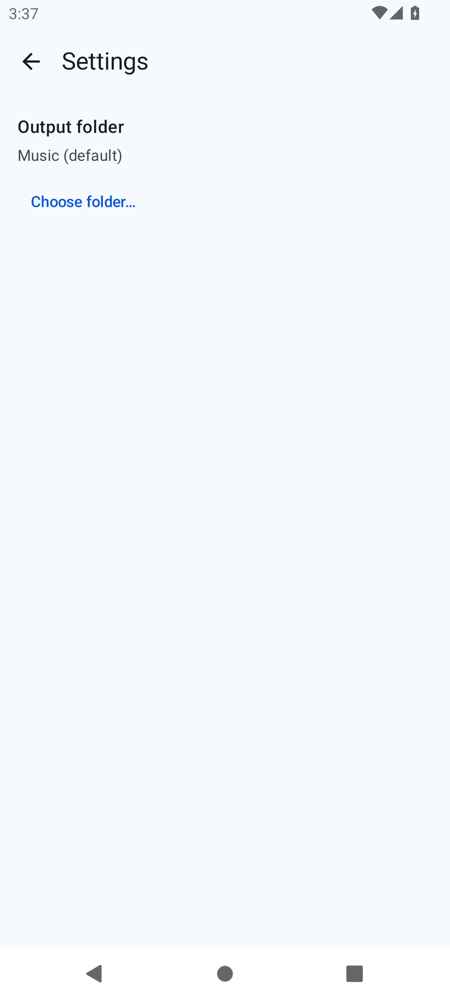

# MP4 to MP3 Converter

A small, free, **offline** Android app that extracts the audio track from a local `.mp4`
video and saves it as an `.mp3`. It does one thing well — MP4 in → MP3 out — and nothing else.

A deliberately narrow spiritual successor to
[brarcher/video-transcoder](https://github.com/brarcher/video-transcoder).

<p>
  
  
</p>

## Features

- Pick one or more `.mp4` files (system document picker, multi-select) and queue them.
- Conversions run **sequentially** in the background via a foreground service, with a progress
  notification and a Cancel action.
- Output goes to the public **Music** folder by default (visible immediately in music
  players/file managers), or to a folder you choose.
- Fixed, sensible encoder defaults: **CBR 192 kbps**, LAME quality 2, source sample
  rate/channels. No settings to fiddle with.
- Clear, friendly errors (no audio track, unsupported format, surround audio, out of space, …)
  — failures never crash the app.

## Privacy — no network, ever

**This app does not request the `INTERNET` permission.** It literally cannot access the
network; nothing you convert leaves your device. A build-time check
([`assertNo…Internet`](app/build.gradle.kts)) fails the build if `INTERNET` ever appears in the
merged manifest. See [`PRIVACY.md`](PRIVACY.md).

The only permissions it requests:

| Permission | Why |
|---|---|
| `FOREGROUND_SERVICE` (+ `…_DATA_SYNC`, `…_MEDIA_PROCESSING`) | Keep converting while the app is backgrounded. |
| `POST_NOTIFICATIONS` | Show conversion progress (Android 13+; the app works fine if you deny it). |

No storage permissions are needed — output uses `MediaStore` and the Storage Access Framework.

## Install

Download the APK from GitHub Releases and install it (you may need to allow installs from your
browser/file manager). Or build it yourself (below). Not on the Play Store.

- **APK size:** ~3 MB (release, R8-shrunk).
- **Requires:** Android 12 (API 31) or newer.

## Build (macOS)

Everything builds from a clean checkout with the Gradle wrapper — no machine-local config
beyond the SDK path.

```sh
# 1. Point Gradle at your Android SDK (git-ignored):
echo "sdk.dir=$HOME/Library/Android/sdk" > local.properties

# 2. Build a debug APK:
./gradlew assembleDebug

# 3. Or a (debug-signed) release APK:
./gradlew assembleRelease   # -> app/build/outputs/apk/release/app-release.apk
```

Requirements: JDK 21, the Android SDK (`compileSdk`/`targetSdk` 36, `minSdk` 31), NDK + CMake
for the native LAME build (see [`gradle/libs.versions.toml`](gradle/libs.versions.toml) and
`app/build.gradle.kts` for exact pinned versions). See [`CONTRIBUTING.md`](CONTRIBUTING.md) for
the test commands and [`docs/TESTING.md`](docs/TESTING.md) for the emulator setup.

## How it works (the short version)

Android has **no system MP3 encoder**, so the app bundles [LAME](https://lame.sourceforge.io/)
(LGPL) as a dynamically linked native library and decodes with the platform's
`MediaExtractor`/`MediaCodec`. See [`docs/ARCHITECTURE.md`](docs/ARCHITECTURE.md) for the full
picture and why not FFmpeg/Media3.

## License

The app's own code is **MIT** ([`LICENSE`](LICENSE)). It bundles LAME (LGPL-2.1) as a separate,
dynamically linked shared library — see [`THIRD_PARTY_LICENSES.md`](THIRD_PARTY_LICENSES.md).
